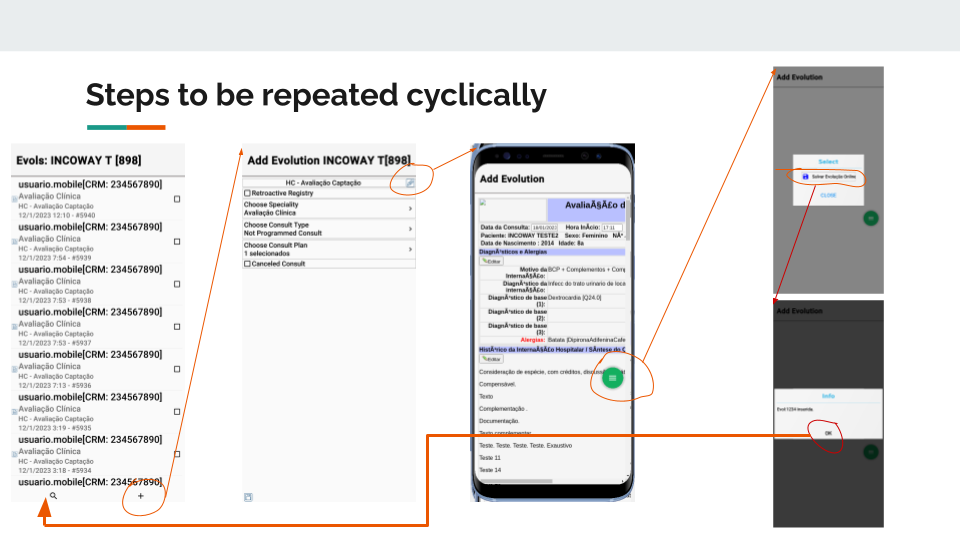

# mini-IwEvolutionMemoLeakApp project

>**This project aims reproduce the leak of memory we are facing in our app.
> As the project is big, we tried to isolate only the pace of code that 
> causes the problem (always it is executed cyclically)**.  
> unfortunately, this Mini-Project has a lot of code too, but we will provide over here,  
> all the info that can make the task of reproduce the problem easier
> 

## Problem description:

>The main feature of this app (input of medical records) was  
>implemented using 3 forms that operate together to reach the goal  
>and deal with all complexities this feature demands.

The app presents memory retention in each complete cycle of Medical record insertion (something about 200MB per cycle).  
On each repetition, the App is becoming slower til the user feels the app was freezing. Finally, It becomes useless.
Also, we observed other memory leaks that have a size of 20MB. These leaks have lower impact til now because it has a scale of 10 times lower than the main leak described above. This bad behavior brings serious problems for our clients. They are health professionals and like to use updated iPhones.

Additional important information:

1) The App was working well until the version of iOS 16.1 comes out.  
So, the problem is specific to our CodeNameOne-app when it is being used over iOS 16.1 (the latest version). The version 15 and earlier the problem doesn't happen or at least not with the intensity to cause problems for our clients.

2) Also, in Android, this problem definitely doesn't happen
   (in all Android versions and device types normally used by our clients)

Finally:

Despite the problem being recent, it is the right moment to handle and solve it.  Before it becomes critical. Our clients continue evolving their iOS devices.

We are requesting your support to solve this issue, without your help we are hands blocked.
Any help will be well appreciated.
Obs:
Some of our major clients already have open issues asking us to solve that.

## How to reproduce:
Although the project has a lot of files, you can focus only in 3 of them.  
They are:
1. com/iw/iwmobile/extensions/evolution/IwFormEvolutionNavig.java
2. com/iw/iwmobile/extentions/evolution/IwFormAddEvolution11.java  
3. com/iw/iwmobile/extentions/evolution/IwFormAddEvolution21.java  

They are the forms that are executed cyclically in this order.  
Each time the cycle finish, something like 200MB are retained.  

The actions that need to be executed is launch the first form
IwFormEvolutionNavig. Pressing the button "+" the second form (IwFormAddEvolution11) 
is launched. This second form allows us to launch the third one (IwFormAddEvolution21).
On the last view (screen), we can save the medical record, finishing one cycle.  
The first form is shown again allowing the repetition of this cycle how many times you want.

>Only what you should do is execute the project. It was coded to provide automatically
the first form. This first form offer a way to access the second
one and the second allows you to reach the third one, and so on.

The slide below illustrates this flow: 

As you can see, the execution of the cycle is very simply. It is only press 5 buttons in   
the sequence shown above in the picture. To get the start point all you need to do is run
the project (mini-app).

